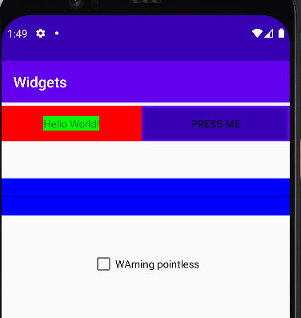

# Rapport

Jag har skapat en appliation som innehåller 4 widgets (3 som inte var med sedan innan.).
Dessa ligger innuti en tablelayout. Dena strukturerar up allt innehåll i rader och kolumner.

Programkod ska se ut som exemplet nedan. Koden måste vara korrekt indenterad då den blir lättare att läsa vilket gör det lättare att hitta syntaktiska fel.

```
<TableLayout
        android:layout_width="match_parent"
        android:layout_height="match_parent"
        android:stretchColumns="*"
        >
        <TableRow
            android:layout_height="100dp"
            android:background="#ff0000"
            android:layout_marginTop="5dp">
```
Jag har skapat en tablelayout. Denna täcker hela ytan som den ligger i, med hjälp av match_parent.
Den har även strukterarat upp kolumnerna innuti den så att de tar upp den yta som existerar i raden.
alla tablerows jag skapar har en margin top för att ge lite utrymme mellan varje rad.

```
<Button
    android:id="@+id/my_button"
    android:background="@drawable/button_border"
    android:text="@string/button_text"
    android:onClick="changeProgress"/>
```
Min knapp. Den kallar på metoden changeProgress och har en förskapad bakgrund. 
Denna bakgrund inehåller struktur för att få knappen att ha en borde och se ut som en knapp.
```
<shape xmlns:android="http://schemas.android.com/apk/res/android"
    android:shape="rectangle">
    <solid android:color="@color/colorPrimaryDark"/>
    <stroke android:color="@color/colorPrimary"
        android:width="3dp"/>
</shape>
```
Border för knappen

```
<ProgressBar
    android:id="@+id/progressbar"
    android:minWidth="1000dp"
    android:layout_height="50dp"
    style="@android:style/Widget.DeviceDefault.ProgressBar.Horizontal"
    android:layout_gravity="center"
    android:progress="0"
    android:background="#0000ff"
    android:layout_span="2"
    />
```
Detta är en progressbar som har en span på 2 kolumner. Den är centrerad och en width så den täcker hela skärmen.
Det finns en definerad style på progressbaren. Den är då hoizontel och har en bar horizontellt.

```
<CheckBox
    android:id="@+id/pointlessCheckBox"
    android:text="@string/pointless"
    android:layout_gravity="center"
    android:layout_span="2"/>
```
Och här har vi en checkbox som ine gör någonting. Den är centrerad och ligger över 2 kolumner.



Såhär ser appen ut.
